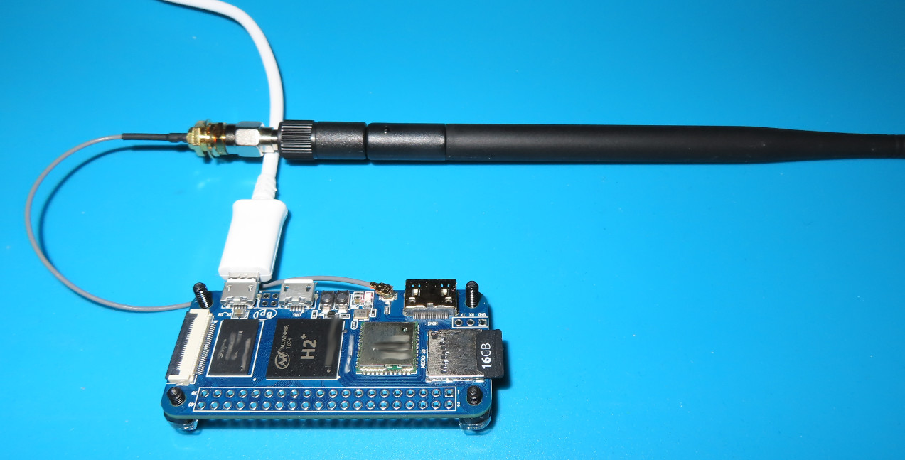
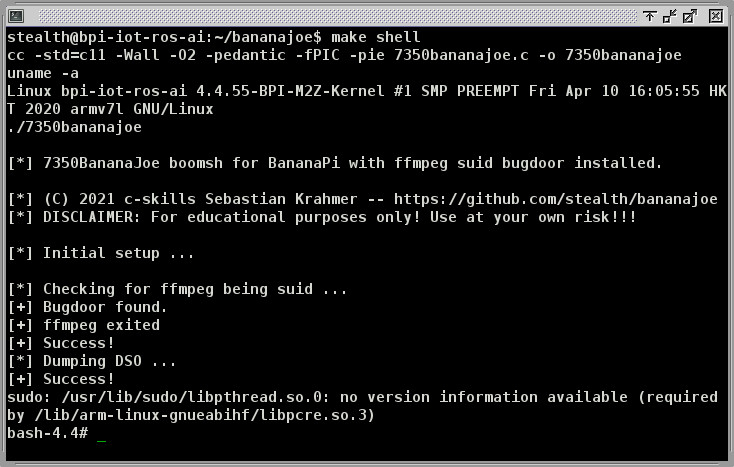

bananajoe
=========

This is a LPE PoC for the *Banana Pi* IoT board. The Debian stretch versions particular for this
board have a bugdoor by shipping the `ffmpeg` binary suid to root. Other fruits are not affected.
With greets from Shenzhen.

Exploitation
------------

The exploit is straight forward. `ffmpeg` may be used to create world writable files
as root. Interestingly, we cannot use the `/etc/ld.so.preload` trick, as this file
already exists on the installation. We use a `sudo` DSO instead which the exploit is
creating.

